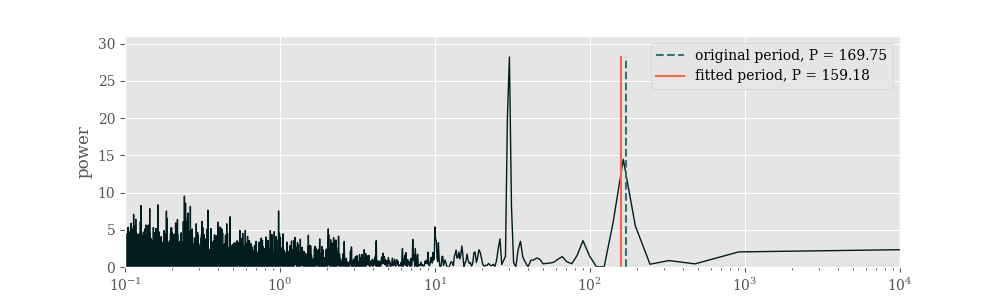

# radiant
`RADIAl velocity from liNe profiles simulaTor`
###### _(wild acronym by [ACRONYM](https://github.com/bacook17/acronym))_

Simulate radial velocity observations of a star using phase-dependent line profile variations and simulated planets.

The simulation uses Keplerian parameters of a planet and LSD profiles to produce a set of observations -- Doppler-shifted LSD profiles, each having 100 points and centered at 5500Å. To simulate instrumental noise, Gaussian noise is added to the LSD profiles (signal-to-noise ratio of 104 introduces spread of approximately 1 m s-1 in radial velocity). The observations between the availbale profiles are interpolated.

## Example

The radial velocity obervations simulated using the provided `input.config` example provided:

The periodogram of the generated dataset, containing two major peaks - rotation of the star and the planet's orbital period:

## Requirements

- Python 3+
- numpy
- scipy
- PyAstronomy
- matplotlib
- progressbar _(optional)_

## Usage

Set the values in `input.config`, such as the star's mass and rotation period, planet's mass and orbital parameters, input files with the line profiles (`.s1` files), plotting and output paths and settings. The example is provided and should be used as a template, comments start with `#` symbol.
To run the simulation, run `$ python main.py` in the directory.

The example `.s1` files contain 100 line profiles each, for different phases of the rotation of the star, based on ZDI observations of ε Eridani with added magnetic spots. See details in _Lisogorskyi et al. 2020_.
